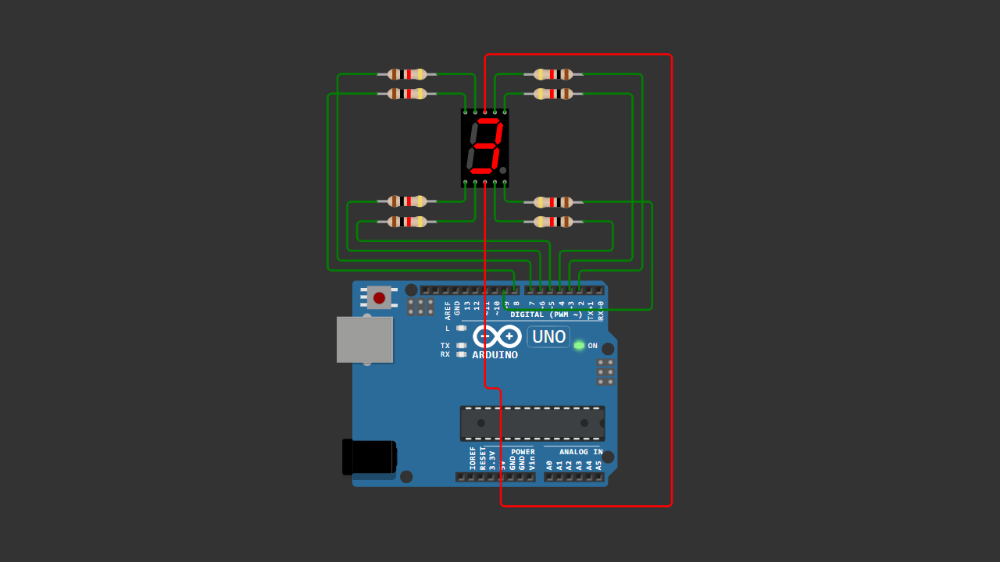

# Arduino 7 Segment Display (Common Anode)

A beginner-friendly Arduino project demonstrating how to control a 7 segment display (Common Anode) without using any external library.

This project displays numbers from 0 to 9 sequentially using direct digital pin control.

---

## 📌 Project Overview

A 7 segment display consists of 7 individual LEDs (a–g) arranged to form numeric digits.

In a **Common Anode** configuration:
- All COM pins are connected to **5V**
- Each segment turns ON when the Arduino outputs **LOW**
- Each segment turns OFF when the Arduino outputs **HIGH**

This example is intentionally written without any external library to help beginners understand how a 7 segment display works at a fundamental level.

---

## 🧰 Components Required

- Arduino Uno / Nano  
- 7 Segment Display (Common Anode)  
- 7x Resistor 220Ω  
- Jumper Wires  
- Breadboard (optional)  

---

## 🔌 Wiring Connections

| Segment | Arduino |
|--------|----------|
| a      | Pin 2    |
| b      | Pin 3    |
| c      | Pin 4    |
| d      | Pin 5    |
| e      | Pin 6    |
| f      | Pin 7    |
| g      | Pin 8    |

| Common Pin | Connection |
|-----------|------------|
| COM1      | 5V         |
| COM2      | 5V         |

> Each segment must use a 220Ω resistor between Arduino and the display.

---

## 📷 Wiring Diagram

> Make sure your wiring matches the diagram above before uploading the code.

---

## 💻 Arduino Code

You can download the Arduino sketch here:

[Download Arduino Code](arduino-seven-segment-basic-0-9-common-anode.ino)

Or open the `.ino` file directly inside this repository.

---

## 🚀 Getting Started

1. Connect all components according to the wiring table.
2. Upload the provided Arduino sketch.
3. The display will automatically count from **0 to 9**.
4. Each number changes every **1 second**.

---

## 🧠 Learning Concepts

This project helps you understand:

- Digital output control
- LED segment mapping
- Common Anode logic (LOW = ON)
- Basic display control
- Embedded system fundamentals

---

## 🔄 Possible Improvements

You can expand this project by adding:

- Push button counter
- Reset button
- 2-digit display (00–99)
- Stopwatch / timer
- Multiplexing technique (advanced)

---

## 🎥 Video Tutorial

Watch the full step-by-step tutorial on YouTube:

In this video, you will see:
- Complete wiring demonstration  
- Code explanation  
- Display counting test  
- Common Anode explanation  

If this project helps you, consider subscribing for more beginner-friendly Arduino tutorials 🚀

---

## 📄 License

This project is open-source and free to use for educational purposes.

---

Happy Coding 🚀
